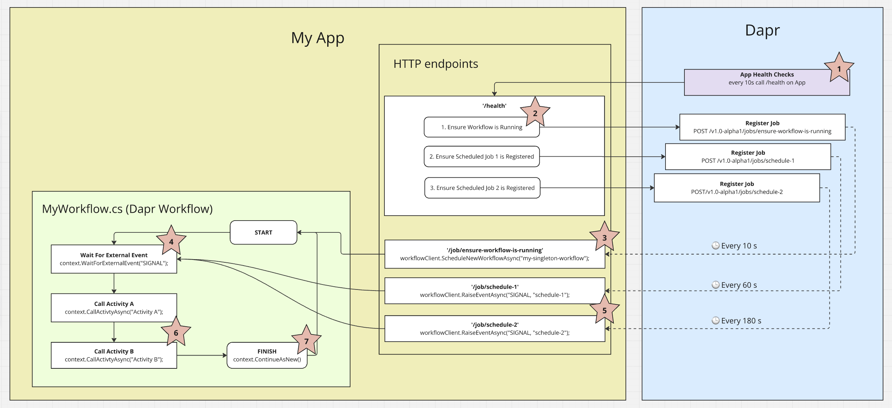

# dapr-workflows-scheduled-job-runner
 
This is a demonstration of a **self-starting** and **self-maintaining** singleton Dapr Workflow process. This Workflow process uses the Eternal pattern (`context.ContinueAsNew()`), so will repeat forever. 

This example leverages Daprs App Health Checks in order to provide a consistent signal to ensure the Workflow instance is created and running, even if it doesn't exist on first run. If the workflow fails, it will be restarted at the next App Health Check (The App Health Check configuration is visible in the Docker Compose file)

This example also leverages Dapr Jobs API to create 2 independent *job schedules*, that both signal the Workflow process when its time to run the Activities.

**1. Run the example**

`docker compose build`

`docker compose up`

**2. Get the Workflow Status**

`HTTP Request`

```bash
curl --request GET \
  --url http://localhost:3500/v1.0/workflows/MyWorkflow/my-singleton-workflow \
  --header 'User-Agent: insomnia/10.3.1'
```

`HTTP Response`

```json
{
	"instanceID": "my-singleton-workflow",
	"workflowName": "MyWorkflow",
	"createdAt": "2025-03-07T17:01:50.059395502Z",
	"lastUpdatedAt": "2025-03-07T17:02:35.044097467Z",
	"runtimeStatus": "RUNNING",
	"properties": {
		"dapr.workflow.custom_status": "\"[03/07/2025 17:02:35] - schedule-1 - Running Activity A...\"",
		"dapr.workflow.input": "{\"Logs\":[\"[03/07/2025 16:50:17] - schedule-1 - All Activities completed successfully. Total duration of Activities = 30.046999s \",\"[03/07/2025 16:51:17] - schedule-2 - All Activities completed successfully. Total duration of Activities = 30.038451s \",\"[03/07/2025 16:52:17] - schedule-2 - All Activities completed successfully. Total duration of Activities = 30.0371737s \",\"[03/07/2025 16:53:17] - schedule-2 - All Activities completed successfully. Total duration of Activities = 30.040741s \",\"[03/07/2025 16:54:17] - schedule-2 - All Activities completed successfully. Total duration of Activities = 30.039s \",\"[03/07/2025 16:55:17] - schedule-2 - All Activities completed successfully. Total duration of Activities = 30.0372374s \",\"[03/07/2025 16:56:17] - schedule-2 - All Activities completed successfully. Total duration of Activities = 30.0388898s \",\"[03/07/2025 16:58:12] - schedule-2 - All Activities completed successfully. Total duration of Activities = 30.1159963s \",\"[03/07/2025 16:59:50] - schedule-1 - All Activities completed successfully. Total duration of Activities = 30.0480485s \",\"[03/07/2025 17:00:50] - schedule-1 - All Activities completed successfully. Total duration of Activities = 30.0305722s \",\"[03/07/2025 17:01:50] - schedule-2 - All Activities completed successfully. Total duration of Activities = 30.0390424s \"]}"
	}
}
```

Let's pretty the `dapr.workflow.input` log...

```json
{
  "Logs": [
    "[03/07/2025 16:50:17] - schedule-1 - All Activities completed successfully. Total duration of Activities = 30.046999s ",
    "[03/07/2025 16:51:17] - schedule-2 - All Activities completed successfully. Total duration of Activities = 30.038451s ",
    "[03/07/2025 16:52:17] - schedule-2 - All Activities completed successfully. Total duration of Activities = 30.0371737s ",
    "[03/07/2025 16:53:17] - schedule-2 - All Activities completed successfully. Total duration of Activities = 30.040741s ",
    "[03/07/2025 16:54:17] - schedule-2 - All Activities completed successfully. Total duration of Activities = 30.039s ",
    "[03/07/2025 16:55:17] - schedule-2 - All Activities completed successfully. Total duration of Activities = 30.0372374s ",
    "[03/07/2025 16:56:17] - schedule-2 - All Activities completed successfully. Total duration of Activities = 30.0388898s ",
    "[03/07/2025 16:58:12] - schedule-2 - All Activities completed successfully. Total duration of Activities = 30.1159963s ",
    "[03/07/2025 16:59:50] - schedule-1 - All Activities completed successfully. Total duration of Activities = 30.0480485s ",
    "[03/07/2025 17:00:50] - schedule-1 - All Activities completed successfully. Total duration of Activities = 30.0305722s ",
    "[03/07/2025 17:01:50] - schedule-2 - All Activities completed successfully. Total duration of Activities = 30.0390424s "
  ]
}
```

Observe both `dapr.workflow.input` and `dapr.workflow.custom_status` to see progress. The log contained in`dapr.workflow.input` is appending, so this will grow unbounded over time. I recommend capping the log size if this was going into a production scenario.

## How it works

1. [App Health Checks](https://docs.dapr.io/operations/resiliency/health-checks/app-health/) are registered in Dapr. Dapr calls `/health` every 10s
2. As part of handling the Health check call from Dapr, the App registers 3 jobs with Dapr. 1 Job is for ensuring the Workflow is started and running. The 2 remaining jobs are the time triggers than run on a predefined schedule.
3. The workflow is checked to see if it is already running, if it is not, it is started.
4. The workflow starts, but waits for a SIGNAL event (The SIGNAL event is the exact time to begin running the Activities)
5. The 2 jobs on a predefined schedule begin to repeatedly trigger. Each trigger, causes a SIGNAL event to be raised in the workflow.
6. The SIGNAL event is received, and the 2 Activities begin processing (in sequence)
7. After the Activities have finished, the Workflow is reset to it's starting state, the loop begins again from point 4, ad infinitum. 


